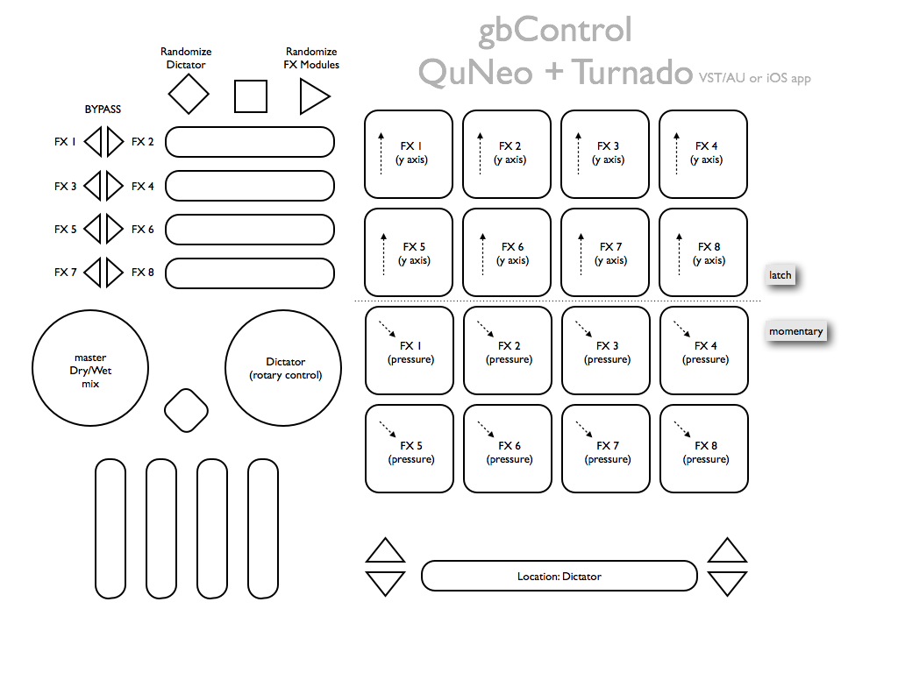

# README

[QuNeo](http://www.keithmcmillen.com/QuNeo/overview) + [Turnado](http://www.sugar-bytes.de/content/products/Turnado/) gbControl version 1.0.

**License:** Please distribute. Please improve. Credit me if you fork and/or distribute. Above all, distribute and improve on this template ([CC-BY](http://creativecommons.org/licenses/by/3.0/)).

Nearly-instant gratification controller for the Turnado effects module. It maps very quickly (a couple of minutes, max), then you're off. The top two rows of pads (knobs 1-4, 5-8) use the Y-axis for setting and latching knob values. The bottom two rows of pads (knobs 1-4, 5-8 again) are momentary switches controlled by continuous pad pressure. Both the long slider and the right rotary can control the Directory for different looping/bouncing motions, and the left rotary controls the master dry/wet effects mix. The 8 buttons next to the horizontal sliders are per-knob bypass toggles. The transport record and play buttons randomize the entire Dictator and entire Modules sections respectively.

## Notes on MIDI Mapping Turnado:
* Right-click on control for VST/AU or tap-hold for iOS app to bring up MIDI Learn/Clear menu
* In Turnado's settings, make sure "CC Recall Lock" is enabled. You may also want to enable "Keep Bypass State" for the bypass buttons to (usually) show their correct toggle state.

Thanks, – gb

---

